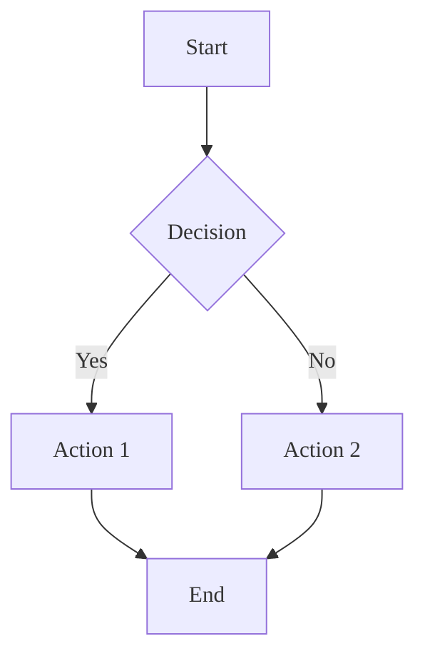
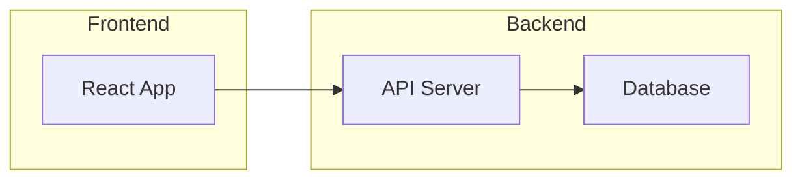
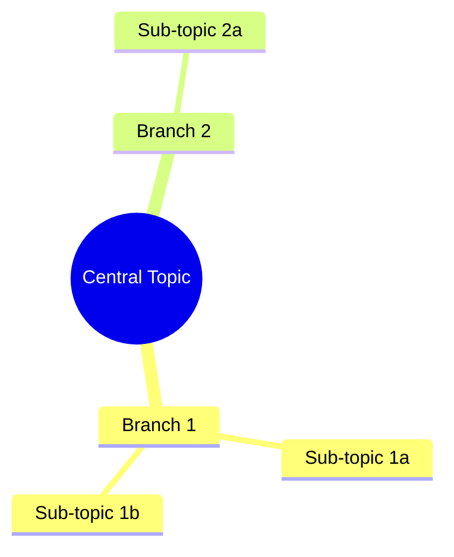
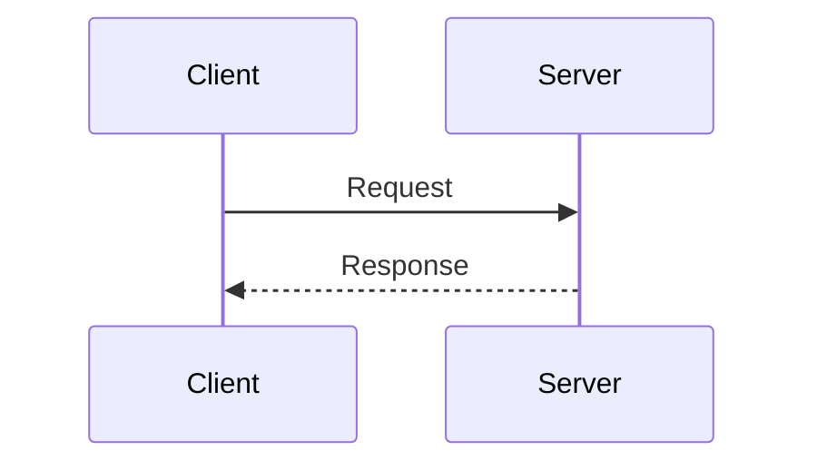

# Sketch Command

Generate visual sketch notes as Excalidraw files with customizable styling.

## Argument Parsing

Parse the command arguments to extract:

| Argument | Short | Type | Default | Description |
|----------|-------|------|---------|-------------|
| `--mode` | `-m` | string | (prompt) | Content mode: `conversation`, `code`, or `custom` |
| `--format` | `-f` | string | (from settings) | Output: `excalidraw`, `png`, `both`, or `direct-png` |
| `--output` | `-o` | string | auto | Output filename (without extension) |
| `--scale` | | number | 2 | PNG scale factor (1, 2, or 4) |
| `[description...]` | | string | | Free-form description for custom mode |

**Format options:**
- `excalidraw` - Editable .excalidraw file only
- `png` - PNG via Excalidraw conversion (keeps .excalidraw as intermediate)
- `both` - Both Excalidraw and PNG files
- `direct-png` - Generate PNG directly using Mermaid (no Excalidraw file)

**Examples:**
```
/sketch                              # Interactive mode selection
/sketch --mode conversation          # Sketch current conversation
/sketch -m code                      # Visualize code architecture
/sketch --mode custom API flow       # Custom sketch with description
/sketch -o my-diagram -m code        # Named output file
/sketch --format png                 # PNG via Excalidraw conversion
/sketch -f both                      # Export both Excalidraw and PNG
/sketch --format direct-png          # Direct PNG generation (no Excalidraw)
/sketch --format png --scale 4       # High-resolution PNG (4x)
```

---

## Execution Flow

### Step 1: Load User Preferences

**Read workbench path from `.claude/jot.local.md`:**

```yaml
---
workbench_path: ~/workbench
---
```

Default: `~/workbench` if not configured or file doesn't exist.

**Read sketch settings from `.claude/sketch-note.local.md`** if it exists:

```yaml
---
background_color: white
roughness: hand-drawn
stroke_width: medium
background_pattern: none
visual_effects: []
resolution: standard
output_format: excalidraw
png_scale: 2
---
```

**If settings file doesn't exist (first-time setup):**

Use AskUserQuestion to gather preferences:

1. **Background color:**
   ```
   Choose a background color for your sketch notes:
   ○ White (Recommended) - Clean, classic look
   ○ Cream - Warm, paper-like feel
   ○ Light Gray - Subtle, modern appearance
   ○ Light Blue - Calm, focused feel
   ○ Light Yellow - Sunny, creative vibe
   ```

2. **Roughness (pen style):**
   ```
   How should your sketches look?
   ○ Hand-drawn (Recommended) - Casual, authentic sketch feel
   ○ Sketchy - Balanced between rough and clean
   ○ Clean - Professional, precise diagrams
   ```

3. **Stroke width:**
   ```
   Choose line thickness:
   ○ Thin - Delicate, detailed lines
   ○ Medium (Recommended) - Balanced visibility
   ○ Bold - Strong emphasis, high impact
   ```

4. **Background pattern:**
   ```
   Add a background pattern?
   ○ None (Recommended) - Clean background
   ○ Dots - Subtle dot grid
   ○ Grid - Square grid lines
   ○ Lines - Horizontal ruled lines
   ```

5. **Visual effects (multi-select):**
   ```
   Select visual effects to apply:
   ☐ Shadow - Add drop shadows to elements
   ☐ Glow - Subtle glow effect around elements
   ☐ Cursive - Use handwriting-style font for text
   ```

6. **Resolution:**
   ```
   Output resolution:
   ○ Standard (Recommended) - Good for most uses
   ○ High - 2x resolution for presentations
   ○ 4K - Maximum quality for large displays
   ```

After gathering all preferences:
- Create `.claude/sketch-note.local.md` with selections
- Show confirmation: "Preferences saved! You can change these anytime by editing `.claude/sketch-note.local.md`"

### Step 2: Determine Content Mode

**If `--mode` argument provided:** Use specified mode

**If no mode specified:** Use AskUserQuestion:
```
What would you like to sketch?
○ Conversation - Summarize our current conversation as visual notes
○ Code Architecture - Visualize code structure from this project
○ Custom - Create a sketch from your own description
```

### Step 3: Gather Content Based on Mode

#### Mode: Conversation

1. **Analyze the conversation history** to extract:
   - Main topics discussed
   - Key decisions made
   - Important concepts explained
   - Action items or next steps
   - Relationships between ideas

2. **Create a visual hierarchy:**
   - Central theme/topic
   - Major branches for subtopics
   - Connections between related concepts
   - Callouts for important points

3. **Structure for Excalidraw:**
   - Title box at top
   - Main concept boxes arranged spatially
   - Arrows showing relationships
   - Text annotations for context

#### Mode: Code Architecture

1. **Discover project structure:**
   - Use Glob to find source files: `**/*.{ts,tsx,js,jsx,py,go,rs,java}`
   - Read key files to understand architecture
   - Identify main modules/packages

2. **Extract architecture elements:**
   - Entry points (main files, index files)
   - Core modules and their responsibilities
   - Dependencies between modules
   - External integrations (APIs, databases)

3. **Create architecture diagram:**
   - Boxes for modules/services
   - Arrows for dependencies/data flow
   - Groups for related components
   - Labels for key interfaces

4. **Ask for scope if large codebase:**
   ```
   This is a large codebase. Which area should I focus on?
   ○ Full overview - High-level architecture only
   ○ Specific directory - Choose a directory to visualize
   ○ Entry point flow - Trace from main entry point
   ```

#### Mode: Custom

1. **Use the description from arguments** or prompt:
   ```
   Describe what you'd like to sketch:
   > [user input]
   ```

2. **Parse the description** to identify:
   - Main entities/concepts
   - Relationships between them
   - Flow direction (if applicable)
   - Groupings or categories

3. **Generate appropriate diagram type:**
   - Flowchart for processes
   - Mind map for concepts
   - Architecture diagram for systems
   - Sequence for interactions

### Step 4: Load Style Configuration

Read style definitions from `${CLAUDE_PLUGIN_ROOT}/styles/` based on preferences:

**Map preferences to Excalidraw properties:**

| Preference | Excalidraw Property |
|------------|---------------------|
| `background_color: white` | `appState.viewBackgroundColor: "#ffffff"` |
| `background_color: cream` | `appState.viewBackgroundColor: "#faf8f5"` |
| `background_color: light-gray` | `appState.viewBackgroundColor: "#f5f5f5"` |
| `background_color: light-blue` | `appState.viewBackgroundColor: "#f0f8ff"` |
| `background_color: light-yellow` | `appState.viewBackgroundColor: "#fffef0"` |
| `roughness: hand-drawn` | `roughness: 2` |
| `roughness: sketchy` | `roughness: 1` |
| `roughness: clean` | `roughness: 0` |
| `stroke_width: thin` | `strokeWidth: 1` |
| `stroke_width: medium` | `strokeWidth: 2` |
| `stroke_width: bold` | `strokeWidth: 4` |

**Visual effects mapping:**
- `shadow`: Add `shadow` element property
- `glow`: Lighter stroke color with blur effect simulation
- `cursive`: Use `fontFamily: 3` (Virgil handwriting font)

**Resolution mapping:**
- `standard`: Default canvas size
- `high`: 2x element scaling
- `4k`: 4x element scaling

### Step 5: Generate Excalidraw JSON

Create valid Excalidraw JSON structure:

```json
{
  "type": "excalidraw",
  "version": 2,
  "source": "sketch-note-plugin",
  "elements": [
    // Generated elements based on content
  ],
  "appState": {
    "viewBackgroundColor": "#ffffff",
    "gridSize": null
  },
  "files": {}
}
```

**Element generation rules:**

1. **Text elements:**
   ```json
   {
     "type": "text",
     "id": "unique-id",
     "x": 100,
     "y": 100,
     "width": 200,
     "height": 30,
     "text": "Label text",
     "fontSize": 20,
     "fontFamily": 1,
     "roughness": 2,
     "strokeColor": "#1e1e1e",
     "backgroundColor": "transparent"
   }
   ```

2. **Rectangle elements (boxes):**
   ```json
   {
     "type": "rectangle",
     "id": "unique-id",
     "x": 50,
     "y": 50,
     "width": 200,
     "height": 100,
     "strokeColor": "#1e1e1e",
     "backgroundColor": "#a5d8ff",
     "fillStyle": "hachure",
     "roughness": 2,
     "strokeWidth": 2
   }
   ```

3. **Arrow elements (connections):**
   ```json
   {
     "type": "arrow",
     "id": "unique-id",
     "x": 250,
     "y": 100,
     "width": 100,
     "height": 0,
     "points": [[0, 0], [100, 0]],
     "strokeColor": "#1e1e1e",
     "roughness": 2,
     "strokeWidth": 2,
     "startBinding": { "elementId": "box-1", "focus": 0, "gap": 5 },
     "endBinding": { "elementId": "box-2", "focus": 0, "gap": 5 }
   }
   ```

**Layout algorithm:**

1. **Calculate positions** to avoid overlaps
2. **Group related elements** spatially
3. **Use consistent spacing** (40px between elements)
4. **Center the diagram** in canvas
5. **Flow direction:** Top-to-bottom for hierarchies, left-to-right for flows

**Color palette for elements:**
- Primary boxes: `#a5d8ff` (light blue)
- Secondary boxes: `#b2f2bb` (light green)
- Accent boxes: `#ffec99` (light yellow)
- Warning boxes: `#ffc9c9` (light red)
- Neutral boxes: `#e9ecef` (light gray)

### Step 6: Determine Output Format and Export Method

This step handles the interactive workflow for choosing output format and PNG generation method.

#### 6a. Detect Available Tools and Runners

**First, detect available tool runners:**
```bash
# Check for nix (preferred - isolated environments)
command -v nix-shell >/dev/null 2>&1 && echo "has_nix"

# Check for npx (fallback - runs without global install)
command -v npx >/dev/null 2>&1 && echo "has_npx"
```

Store:
- `has_nix`: true/false
- `has_npx`: true/false

**Then, check for globally installed tools:**
```bash
# Direct PNG generation (no Excalidraw intermediate)
command -v mmdc >/dev/null 2>&1 && echo "mermaid-cli"

# Excalidraw to PNG converters
command -v excalidraw-brute-export-cli >/dev/null 2>&1 && echo "brute-export"
command -v excalidraw-cli >/dev/null 2>&1 && echo "excalidraw-cli"
```

Store results:
- `has_mermaid`: true/false (for direct PNG)
- `has_brute_export`: true/false
- `has_excalidraw_cli`: true/false

**Tool availability logic:**
A tool is "available" if ANY of these are true:
1. Globally installed (`command -v {tool}` succeeds)
2. Nix is available (can run via `nix-shell -p`)
3. npx is available (can run via `npx`)

If `has_nix` or `has_npx` is true, all tools are considered available (will run on-demand).

#### 6b. Determine Output Format

**If `--format` argument provided:** Use specified format, skip to 6c

**If no format specified:** Use AskUserQuestion:
```
What output format would you like?
○ Excalidraw only (Recommended) - Editable .excalidraw file
○ PNG + Excalidraw - Both formats for sharing and editing
○ Direct PNG - Generate PNG directly (no Excalidraw file)
```

#### 6c. Handle PNG Generation Method (if PNG requested)

**If format is `excalidraw` only:** Skip to Step 7

**If format is `direct-png`:** Go to 6c-direct

**If format is `png` or `both`:** Go to 6c-convert

##### 6c-direct: Direct PNG Generation (no Excalidraw)

This workflow generates PNG directly without creating an intermediate Excalidraw file.

**Determine how to run mermaid-cli:**

1. **If globally installed:** Use `mmdc` directly
2. **If nix available:** Use `nix-shell -p mermaid-cli --run "mmdc ..."`
3. **If npx available:** Use `npx -y @mermaid-js/mermaid-cli ...`
4. **None available:** Prompt user

**If mermaid-cli is available (globally, via nix, or via npx):**
```
Using Mermaid CLI for direct PNG generation with hand-drawn style.
{via nix-shell | via npx | globally installed}
```
- Set `generation_method: mermaid`
- Set `mermaid_runner`: `global` | `nix` | `npx`
- Skip Excalidraw generation entirely (go to Step 7-direct)

**If NO runner is available (no nix, no npx, not installed):**
Use AskUserQuestion:
```
Direct PNG requires Mermaid CLI and no runner is available. How would you like to proceed?
○ Install mermaid-cli globally - npm install -g @mermaid-js/mermaid-cli
○ Use Excalidraw conversion - Create Excalidraw first, then convert to PNG
○ Excalidraw only - Create editable file, export PNG manually later
○ Cancel - Stop and install tools first
```

**If user chooses to install mermaid-cli:**
```bash
npm install -g @mermaid-js/mermaid-cli
```

After installation, verify:
```bash
command -v mmdc >/dev/null 2>&1 && echo "installed"
```

##### 6c-convert: Excalidraw to PNG Conversion

**Determine how to run each tool:**

| Tool | Nix Package | NPM Package |
|------|-------------|-------------|
| excalidraw-brute-export-cli | N/A (use npx) | excalidraw-brute-export-cli |
| excalidraw-cli | N/A (use npx) | @tommywalkie/excalidraw-cli |

**Runner priority:**
1. Global install (if available)
2. nix-shell (if nix available) - Note: These packages may not be in nixpkgs, fall back to npx
3. npx (if available)

**If nix or npx is available:**
All tools are considered available. Determine which runner to use:
- Set `excalidraw_runner`: `global` | `npx`

**Case 1: Multiple tools available (or runners available)**
Use AskUserQuestion:
```
Which export tool would you like to use?
○ excalidraw-brute-export-cli (Recommended) - Highest fidelity, uses headless Firefox
○ excalidraw-cli - Faster export, uses node-canvas (may differ slightly)
```

**Case 2: Only one tool globally installed (and no npx)**
Auto-select the available tool:
```
Using {tool-name} for PNG export.
```

**Case 3: No tools available AND no npx**
Use AskUserQuestion:
```
PNG conversion requires a CLI tool. None detected and npx unavailable. How would you like to proceed?
○ Install excalidraw-brute-export-cli (Recommended) - Highest fidelity
○ Install excalidraw-cli - Faster, no browser dependency
○ Try direct PNG - Use Mermaid for direct generation instead
○ Skip PNG - Create Excalidraw file only, export manually later
○ Cancel - Stop and install tools first
```

**If user chooses to install:**

For `excalidraw-brute-export-cli`:
```bash
npm install -g excalidraw-brute-export-cli && npx playwright install firefox
```

For `excalidraw-cli`:
```bash
npm install -g @tommywalkie/excalidraw-cli
```

After installation, verify:
```bash
command -v {tool} >/dev/null 2>&1 && echo "installed"
```

If installation succeeds, continue with export.
If installation fails, show error and offer to continue with Excalidraw only.

**If user chooses "Skip PNG":**
- Set format to `excalidraw`
- Continue to Step 7
- Show note: "You can manually export to PNG at excalidraw.com"

**If user chooses "Cancel":**
- Exit with message: "Run the command again after installing an export tool."

#### 6d. Determine PNG Scale (if PNG requested)

**If `--scale` argument provided:** Use specified scale
**Otherwise:** Use `png_scale` from settings (default: 2)

Store: `generation_method` (mermaid | excalidraw-convert), `selected_tool`, `png_scale`, `final_format`

### Step 7: Determine Output Path

**Output location:** `${workbench_path}/sketches/` (from Step 1)

**If `--output` provided:** Use specified name
**Otherwise:** Generate name based on mode and timestamp

**For Excalidraw-based output:**
```
${workbench_path}/sketches/{mode}-{timestamp}.excalidraw
```

**For Direct PNG output:**
```
${workbench_path}/sketches/{mode}-{timestamp}.png
```

Examples (assuming default workbench_path: `~/workbench`):
- `~/workbench/sketches/conversation-20240115-143022.excalidraw`
- `~/workbench/sketches/code-architecture-20240115-143022.excalidraw`
- `~/workbench/sketches/my-api-flow.excalidraw` (if --output my-api-flow)
- `~/workbench/sketches/api-flow-20240115-143022.png` (direct PNG)

**Create sketches directory if needed:**
```bash
mkdir -p "${workbench_path}/sketches"
```

---

## Direct PNG Generation (Mermaid Workflow)

**If `generation_method` is `mermaid`:** Follow this workflow instead of Steps 8-9.

### Step 8-direct: Generate Mermaid Diagram Definition

Convert the content (from Step 3) into Mermaid diagram syntax.

**For flowcharts/processes:**


**For architecture diagrams:**


**For mind maps:**


**For sequence diagrams:**


**Style configuration for hand-drawn look:**
```json
{
  "theme": "default",
  "look": "handDrawn",
  "themeVariables": {
    "fontFamily": "Virgil, Comic Sans MS, cursive"
  }
}
```

### Step 9-direct: Generate PNG with Mermaid CLI

1. **Write the Mermaid definition to a temp file:**
   ```bash
   cat > /tmp/sketch-{timestamp}.mmd << 'EOF'
   {mermaid-definition}
   EOF
   ```

2. **Create config for hand-drawn style:**
   ```bash
   cat > /tmp/mermaid-config.json << 'EOF'
   {
     "theme": "default",
     "look": "handDrawn"
   }
   EOF
   ```

3. **Generate PNG based on `mermaid_runner`:**

   **If `mermaid_runner: global`:**
   ```bash
   mmdc -i /tmp/sketch-{timestamp}.mmd \
        -o "${workbench_path}/sketches/{filename}.png" \
        -c /tmp/mermaid-config.json \
        -s {png_scale} \
        -b transparent
   ```

   **If `mermaid_runner: nix`:**
   ```bash
   nix-shell -p mermaid-cli --run "mmdc -i /tmp/sketch-{timestamp}.mmd \
        -o \"${workbench_path}/sketches/{filename}.png\" \
        -c /tmp/mermaid-config.json \
        -s {png_scale} \
        -b transparent"
   ```

   **If `mermaid_runner: npx`:**
   ```bash
   npx -y @mermaid-js/mermaid-cli -i /tmp/sketch-{timestamp}.mmd \
        -o "${workbench_path}/sketches/{filename}.png" \
        -c /tmp/mermaid-config.json \
        -s {png_scale} \
        -b transparent
   ```

   **Scale mapping:**
   - `png_scale: 1` → `-s 1`
   - `png_scale: 2` → `-s 2`
   - `png_scale: 4` → `-s 4`

4. **Clean up temp files:**
   ```bash
   rm /tmp/sketch-{timestamp}.mmd /tmp/mermaid-config.json
   ```

5. **If generation fails:**
   - Show error message
   - Offer to create Excalidraw file instead as fallback

**Skip to Step 10** for success message.

---

## Excalidraw-based Workflow

**If `generation_method` is `excalidraw-convert` or format is `excalidraw`:** Follow Steps 8-9 below.

### Step 8: Write Excalidraw File

1. **Write the Excalidraw JSON file:**
   ```
   Write to: ${workbench_path}/sketches/{filename}.excalidraw
   ```

2. **If format is `png` only:** Continue to Step 9 (PNG export), then delete the .excalidraw file after successful PNG creation

3. **If format is `excalidraw` or `both`:** Keep the .excalidraw file

### Step 9: Export to PNG (if format is `png` or `both`)

Use the `selected_tool` and `excalidraw_runner` determined in Step 6c.

**For excalidraw-brute-export-cli:**

*If globally installed (`excalidraw_runner: global`):*
```bash
excalidraw-brute-export-cli -i "${workbench_path}/sketches/{filename}.excalidraw" \
  --format png \
  --scale {png_scale} \
  --background 1 \
  -o "${workbench_path}/sketches/{filename}.png"
```

*If via npx (`excalidraw_runner: npx`):*
```bash
npx -y excalidraw-brute-export-cli -i "${workbench_path}/sketches/{filename}.excalidraw" \
  --format png \
  --scale {png_scale} \
  --background 1 \
  -o "${workbench_path}/sketches/{filename}.png"
```

**For excalidraw-cli:**

*If globally installed (`excalidraw_runner: global`):*
```bash
excalidraw-cli "${workbench_path}/sketches/{filename}.excalidraw" "${workbench_path}/sketches/"
```

*If via npx (`excalidraw_runner: npx`):*
```bash
npx -y @tommywalkie/excalidraw-cli "${workbench_path}/sketches/{filename}.excalidraw" "${workbench_path}/sketches/"
```

**If export fails:**
- Show error message
- Keep the .excalidraw file
- Suggest manual export: "Export failed. You can manually export at excalidraw.com"

**If format was `png` only and export succeeded:**
- Delete the temporary .excalidraw file:
  ```bash
  rm "${workbench_path}/sketches/{filename}.excalidraw"
  ```

### Step 10: Show Success Message

**If only Excalidraw generated:**
```
✓ Sketch created: ~/workbench/sketches/conversation-20240115-143022.excalidraw

Elements: 12 boxes, 8 arrows, 15 text labels
Style: hand-drawn, medium stroke, white background

Open in Excalidraw:
- Visit excalidraw.com and drag the file to open
- Or use VS Code with Excalidraw extension
```

**If PNG + Excalidraw generated (via conversion):**
```
✓ Sketch created:
  - ~/workbench/sketches/conversation-20240115-143022.excalidraw (editable)
  - ~/workbench/sketches/conversation-20240115-143022.png (2x scale, via {tool-name})

Elements: 12 boxes, 8 arrows, 15 text labels
Style: hand-drawn, medium stroke, white background
```

**If PNG via conversion only (format=png):**
```
✓ Sketch exported: ~/workbench/sketches/conversation-20240115-143022.png (2x scale, via {tool-name})

Elements: 12 boxes, 8 arrows, 15 text labels
Style: hand-drawn, medium stroke, white background

Note: Excalidraw source not saved. Use --format both to keep editable version.
```

**If Direct PNG generated (via Mermaid):**
```
✓ Sketch created: ~/workbench/sketches/conversation-20240115-143022.png (2x scale, via Mermaid)

Diagram type: flowchart
Style: hand-drawn theme

Note: This is a direct PNG - no editable source file.
Use --format excalidraw or --format both if you need to edit later.
```

**If PNG was skipped (no tools, user chose to skip):**
```
✓ Sketch created: ~/workbench/sketches/conversation-20240115-143022.excalidraw

Elements: 12 boxes, 8 arrows, 15 text labels
Style: hand-drawn, medium stroke, white background

PNG export skipped. To export manually:
- Open at excalidraw.com and use Export menu
- Or install: npm install -g excalidraw-brute-export-cli
```

**Offer follow-up options:**
```
What would you like to do next?
○ Open location - Show the file in finder/explorer
○ Create another - Make another sketch
○ Done - Finish
```

---

## Background Pattern Implementation

Since Excalidraw doesn't have native background patterns, implement them as subtle elements:

**Dots pattern:**
- Create small ellipse elements in a grid pattern
- Color: Very light gray (#e0e0e0)
- Size: 2px diameter
- Spacing: 20px grid

**Grid pattern:**
- Create line elements forming a grid
- Color: Very light gray (#e8e8e8)
- Stroke width: 0.5px
- Spacing: 20px

**Lines pattern:**
- Create horizontal line elements
- Color: Very light gray (#e8e8e8)
- Stroke width: 0.5px
- Spacing: 30px

**Note:** Pattern elements should be at the back (lowest z-index) and non-interactive.

---

## Settings File Template

When creating `.claude/sketch-note.local.md`:

```markdown
---
background_color: white
roughness: hand-drawn
stroke_width: medium
background_pattern: none
visual_effects: []
resolution: standard
output_format: excalidraw
png_scale: 2
---

# Sketch Note Plugin Settings

Your preferences for generating sketch notes.

## Available Options

| Setting | Options | Description |
|---------|---------|-------------|
| background_color | white, cream, light-gray, light-blue, light-yellow | Canvas background |
| roughness | hand-drawn, sketchy, clean | Line roughness style |
| stroke_width | thin, medium, bold | Line thickness |
| background_pattern | none, dots, grid, lines | Background pattern |
| visual_effects | shadow, glow, cursive | Effects (array, multi-select) |
| resolution | standard, high, 4k | Output resolution |
| output_format | excalidraw, png, both, direct-png | Default output format |
| png_scale | 1, 2, 4 | PNG export scale (1x, 2x, 4x) |

## Examples

Change to clean professional style:
```yaml
roughness: clean
stroke_width: thin
background_color: white
```

Warm creative style:
```yaml
roughness: hand-drawn
background_color: cream
visual_effects: [cursive, shadow]
```

Always export PNG alongside Excalidraw:
```yaml
output_format: both
png_scale: 2
```

High-resolution PNG only:
```yaml
output_format: png
png_scale: 4
```
```

---

## Error Handling

### No Content to Sketch

**Conversation mode with no conversation:**
```
No conversation history to sketch.
Try using:
- /sketch --mode custom "your description"
- /sketch --mode code
```

### Code Mode in Empty Directory

```
No source files found in this directory.
Make sure you're in a project directory with source code.
```

### Invalid Mode

```
Invalid mode: "{mode}"
Available modes: conversation, code, custom
```

### Write Permission Error

```
Cannot create sketches directory.
Please check write permissions or specify a different location with --output.
```

---

## Important Notes

- **Excalidraw compatibility:** Generated files work with excalidraw.com and VS Code extension
- **Unique IDs:** Generate unique IDs for each element using timestamp + random suffix
- **Bindings:** Arrow bindings require valid element IDs for connected boxes
- **Z-index:** Background patterns first, then boxes, then arrows, then text on top
- **Font family:** Use 1 (normal), 2 (code), or 3 (handwriting/Virgil)
- **File extension:** Always use `.excalidraw` extension
