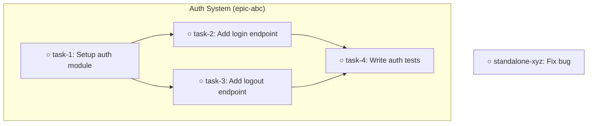

# /deps Command

Manage and visualize task dependencies. Dependencies define what must complete before a task can start.

## Subcommands

| Subcommand | Description | Example |
|------------|-------------|---------|
| `add` | Add a dependency | `/deps add task1 task2` |
| `remove` | Remove a dependency | `/deps remove task1 task2` |
| `show` | Show what blocks a task | `/deps show task1` |
| `graph` | Visualize dependency graph | `/deps graph` |

---

## /deps add <task> <depends-on>

Add a dependency: `task` depends on `depends-on` (depends-on blocks task).

### Arguments

| Argument | Type | Description |
|----------|------|-------------|
| `task` | string | The task that has the dependency |
| `depends-on` | string | The task that must complete first |

### Examples

```bash
/deps add write-tests implement-feature
# "write-tests" depends on "implement-feature"
# Cannot start write-tests until implement-feature is done

/deps add abc123 def456
```

### Execution

```bash
bd dep add {task} {depends-on}
```

### Output

```
Dependency added:
  {task-id} - {task-title}
    └── depends on: {depends-on-id} - {depends-on-title}

{task-id} is now blocked until {depends-on-id} is completed.
```

### Validation

Before adding:
1. Verify both tasks exist
2. Check for circular dependencies
3. Warn if dependency already exists

**Circular dependency detected:**
```
Error: Cannot add dependency - would create a cycle.

Current chain:
  {a} → {b} → {c} → {a} (cycle!)

Remove an existing dependency first to break the cycle.
```

**Dependency exists:**
```
Dependency already exists:
  {task} depends on {depends-on}

No changes made.
```

---

## /deps remove <task> <depends-on>

Remove an existing dependency.

### Arguments

| Argument | Type | Description |
|----------|------|-------------|
| `task` | string | The task that has the dependency |
| `depends-on` | string | The dependency to remove |

### Examples

```bash
/deps remove write-tests implement-feature
/deps remove abc123 def456
```

### Execution

```bash
bd dep remove {task} {depends-on}
```

### Output

```
Dependency removed:
  {task-id} no longer depends on {depends-on-id}

{task-id} may now be ready to work on.
Check: bd show {task-id}
```

### Validation

**Dependency doesn't exist:**
```
Error: No dependency found.

{task-id} does not depend on {depends-on-id}.

Current dependencies for {task-id}:
- {dep1-id} - {dep1-title}
- {dep2-id} - {dep2-title}
```

---

## /deps show <task-id>

Show what a task depends on and what depends on it.

### Arguments

| Argument | Short | Type | Default | Description |
|----------|-------|------|---------|-------------|
| `task-id` | | string | (required) | Task to show dependencies for |
| `--format` | `-f` | string | `text` | Output format: text, json, tree |

### Examples

```bash
/deps show abc123
/deps show abc123 --format tree
```

### Execution

```bash
bd show {task-id} --json
# Extract blockedBy and blocks from the response
```

### Output

**Text format:**
```
## Dependencies for: {title} ({task-id})

**Status:** {status}

### Blocked By (must complete first)
- {dep-id} - {dep-title} ({status})
- {dep-id} - {dep-title} ({status})

{If all completed:} ✓ All dependencies resolved - task is ready!
{If some open:} ⚠ {n} dependencies still open

### Blocks (waiting on this task)
- {id} - {title} ({status})
- {id} - {title} ({status})

{n} tasks will be unblocked when this completes.
```

**Tree format:**
```
## Dependencies for: {title}

Blocked By:
└── {dep-id} - {dep-title}
    └── {dep-dep-id} - {dep-dep-title} (transitive)

Blocks:
├── {blocked-id} - {blocked-title}
│   └── {blocked-blocked-id} - ... (transitive)
└── {blocked-id} - {blocked-title}
```

**No dependencies:**
```
## Dependencies for: {title} ({task-id})

No dependencies.

This task:
- Is not blocked by anything
- Does not block any other tasks
```

---

## /deps graph [task-id]

Visualize the dependency graph. If task-id provided, show graph centered on that task.

### Arguments

| Argument | Short | Type | Default | Description |
|----------|-------|------|---------|-------------|
| `task-id` | | string | (none) | Center graph on this task |
| `--format` | `-f` | string | `tree` | Format: tree, mermaid, json |
| `--depth` | `-d` | number | 3 | Max depth to traverse |
| `--epic` | `-e` | string | (none) | Show graph for epic only |

### Examples

```bash
/deps graph
/deps graph abc123
/deps graph --format mermaid
/deps graph -e epic123
```

### Execution

```bash
# Get all tasks with dependencies
bd list --json
# Parse and build dependency graph
```

### Output

**Tree format (default):**
```
## Dependency Graph

### Legend
○ = open, ◐ = in_progress, ● = closed

### Graph

epic-abc - Auth System
├── ○ task-1 - Setup auth module
├── ○ task-2 - Add login endpoint
│   └── depends on: task-1
├── ○ task-3 - Add logout endpoint
│   └── depends on: task-1
└── ○ task-4 - Write auth tests
    └── depends on: task-2, task-3

standalone-xyz - Fix bug
(no dependencies)
```

**Mermaid format:**
```
## Dependency Graph (Mermaid)



Copy this to a Mermaid-compatible viewer to visualize.
```

**Centered on task:**
```
## Dependency Graph for: {title}

### Upstream (what this depends on)
{dep-1}
└── {dep-1-dep}

### This Task
→ {task-id} - {title} ←

### Downstream (what depends on this)
{blocked-1}
├── {blocked-1-blocked}
└── {blocked-2}
```

---

## Dependency Concepts

### Terminology

| Term | Meaning |
|------|---------|
| **depends on** | A must complete before B can start |
| **blocked by** | Same as "depends on" - B is blocked by A |
| **blocks** | If A blocks B, B cannot start until A is done |
| **transitive** | If A→B→C, A transitively blocks C |

### Common Patterns

**Sequential:**
```
A → B → C
Task A, then B, then C
```

**Parallel with join:**
```
A ─┬─→ C
   │
B ─┘
Tasks A and B can run in parallel, C needs both
```

**Fan-out:**
```
    ┌→ B
A ──┼→ C
    └→ D
Task A enables B, C, and D to start
```

---

## Error Handling

### No subcommand provided
```
Usage: /deps <subcommand> [args]

Subcommands:
  add <task> <depends-on>     Add dependency
  remove <task> <depends-on>  Remove dependency
  show <task>                 Show task dependencies
  graph [task]                Visualize dependency graph

Example: /deps add write-tests implement-feature
```

### Task not found
```
Error: Task "{id}" not found.

Check the ID and try again.
```

### Circular dependency
```
Error: Cannot add dependency - creates circular dependency.

{a} → {b} → {c} → {a}

This would make it impossible to complete any of these tasks.
```

### Self-dependency
```
Error: A task cannot depend on itself.
```

### No dependencies in project
```
## Dependency Graph

No dependencies defined in this project.

All tasks are independent and can be worked in any order.

Add dependencies: /deps add <task> <depends-on>
```
